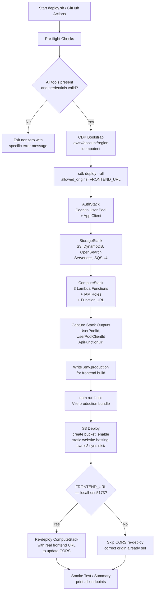
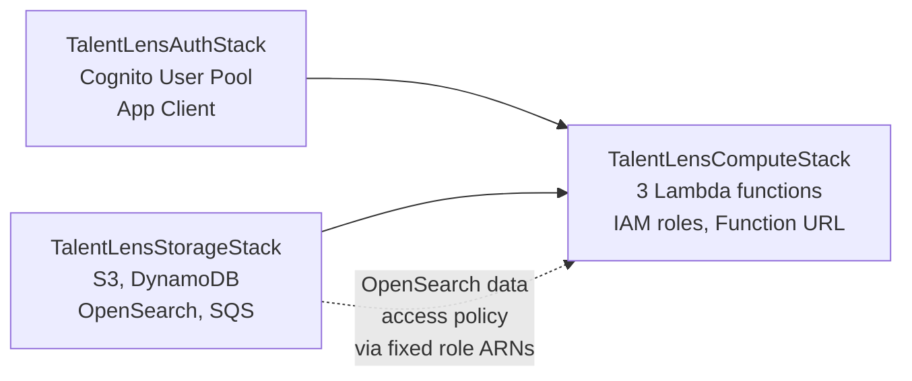

# Design Document: TalentLens Deployment

## Overview

TalentLens is a full-stack AI-powered candidate ranking application deployed entirely on
AWS. The deployment system provisions and wires together three CDK stacks (AuthStack,
StorageStack, ComputeStack), three Docker-based Lambda functions, a React/Vite frontend
hosted on S3, and a GitHub Actions CI/CD pipeline.

The `deploy.sh` script at the project root is the primary deployment orchestrator for
manual or first-time deployments. The GitHub Actions workflow (`deploy.yml`) provides
the automated path for CI/CD on merge to `main`. Both paths converge on the same
sequence: pre-flight verification → CDK bootstrap → stack deployment → output capture
→ frontend build → S3 deploy → CORS update.

The target environment is AWS account `022784798053`, region `us-east-1`.

---

## Architecture

### Deployment Pipeline Flow



### AWS Resource Topology

```mermaid
graph TB
    subgraph Frontend
        FE[React/Vite SPA<br/>S3 Static Website<br/>talentlens-frontend-{account}]
    end

    subgraph Compute
        API[Lambda: talentlens-api<br/>512 MB / 30s<br/>FastAPI via Mangum<br/>Function URL - public]
        PARSER[Lambda: talentlens-parser<br/>1024 MB / 120s<br/>SQS triggered<br/>concurrency: 5]
        RANKER[Lambda: talentlens-ranker<br/>1024 MB / 900s<br/>SQS triggered<br/>concurrency: 3]
    end

    subgraph Storage
        S3R[S3: talentlens-resumes<br/>24h lifecycle<br/>server-side encryption]
        DDB[DynamoDB: talentlens-main<br/>single-table, on-demand<br/>TTL, GSI1]
        AOSS[OpenSearch Serverless<br/>talentlens-vectors<br/>VECTORSEARCH type]
        PQ[SQS FIFO: resume-parse-queue<br/>DLQ: resume-parse-dlq<br/>maxReceive: 3]
        RQ[SQS FIFO: rank-job-queue<br/>DLQ: rank-job-dlq<br/>maxReceive: 2]
    end

    subgraph Auth
        COGNITO[Cognito User Pool<br/>talentlens-users<br/>email sign-in, SRP]
    end

    subgraph AI
        NOVA[Bedrock: amazon.nova-pro-v1:0<br/>text generation / ranking]
        TITAN[Bedrock: amazon.titan-embed-text-v2:0<br/>vector embeddings]
        TXT[Amazon Textract<br/>document text extraction]
    end

    subgraph ECR
        ECR_API[ECR Image: talentlens-api]
        ECR_PARSER[ECR Image: talentlens-parser]
        ECR_RANKER[ECR Image: talentlens-ranker]
    end

    FE -- HTTPS --> API
    API -- reads/writes --> DDB
    API -- read/write --> S3R
    API -- send message --> PQ
    API -- send message --> RQ
    PQ -- event source --> PARSER
    RQ -- event source --> RANKER
    PARSER -- write --> DDB
    PARSER -- write --> AOSS
    PARSER -- read --> S3R
    PARSER -- invoke --> NOVA
    PARSER -- invoke --> TITAN
    PARSER -- invoke --> TXT
    RANKER -- read --> DDB
    RANKER -- read/write --> AOSS
    RANKER -- write --> DDB
    RANKER -- invoke --> NOVA
    RANKER -- invoke --> TITAN
    API -- verify JWT --> COGNITO
    ECR_API -- image source --> API
    ECR_PARSER -- image source --> PARSER
    ECR_RANKER -- image source --> RANKER
```

### Stack Dependency Graph



The `add_dependency` calls in `app.py` enforce this ordering in CloudFormation. The
circular-dependency problem (Compute needs Storage's resources; Storage's OpenSearch
data-access policy needs Compute's role ARNs) is resolved by using fixed, predictable
IAM role names (`talentlens-{api,parser,ranker}-execution-role`) so `app.py` can derive
role ARNs as plain strings without reading resolved tokens from the ComputeStack.

---

## Components and Interfaces

### 1. deploy.sh — Bash Orchestrator

The script is structured as eight numbered phases, each with explicit error handling via
`set -euo pipefail` and a custom `error()` function that exits nonzero.

| Phase | Action | Key behavior |
|---|---|---|
| 1 | Pre-flight checks | Verifies 6 CLI tools, Docker daemon, AWS credentials, account ID match |
| 2 | CDK Bootstrap | Idempotent; creates/updates CDK toolkit stack |
| 3 | CDK Deploy (all stacks) | `cdk deploy --all`, passes `allowed_origins` context |
| 4 | Capture stack outputs | AWS CLI `describe-stacks` for 3 outputs; exits if any missing |
| 5 | Frontend build | `npm install` + writes `.env.production` + `npm run build` |
| 6 | S3 deploy | Create bucket (idempotent), enable website hosting, `aws s3 sync --delete` |
| 7 | CORS update | Conditional re-deploy of ComputeStack if FRONTEND_URL was localhost |
| 8 | Summary | Prints all endpoints and credentials |

**Interface**: The script accepts one optional environment variable: `FRONTEND_URL`
(defaults to `http://localhost:5173`). It exports `CDK_DEFAULT_ACCOUNT` and
`CDK_DEFAULT_REGION` before CDK calls.

### 2. CDK Stacks

#### TalentLensAuthStack
- **Provisions**: Cognito User Pool (`talentlens-users`) and App Client (`talentlens-web-client`)
- **Sign-in**: email only; SRP + USER_PASSWORD_AUTH flows
- **Token validity**: access/id 1 hour, refresh 30 days
- **Outputs**: `UserPoolId`, `UserPoolClientId` (also exported as CloudFormation exports)
- **Removal policy**: DESTROY (PoC/development setting)

#### TalentLensStorageStack
- **S3 resume bucket**: `talentlens-resumes-{account}-{region}`, S3-managed encryption,
  24-hour lifecycle expiry, public access blocked, CORS open (PUT/GET from `*`)
- **DynamoDB**: `talentlens-main`, single-table design, PK+SK with GSI1, on-demand
  billing, TTL on `expires_at`
- **SQS**: 4 FIFO queues (2 main + 2 DLQs). Parse queue: visibility 150s, maxReceive 3.
  Rank queue: visibility 950s, maxReceive 2.
- **OpenSearch Serverless**: `talentlens-vectors`, VECTORSEARCH type; encryption and
  network policies attached before collection; data-access policy attached from `app.py`
- **Outputs**: bucket name, table name, queue URLs, OpenSearch endpoint

#### TalentLensComputeStack
- **Three Lambda functions**: all Docker-image based (x86_64, ECR asset bundling via CDK)
- **Explicit IAM roles**: fixed names enable cross-stack OpenSearch data-access policy
  without circular dependencies
- **Lambda_API**: 512 MB, 30s timeout; adds Function URL (NONE auth) with CORS config
- **Lambda_Parser**: 1024 MB, 120s timeout; SQS event source (parse queue, batch=1,
  reportBatchItemFailures=true), reservedConcurrency=5
- **Lambda_Ranker**: 1024 MB, 900s timeout; SQS event source (rank queue, batch=1,
  reportBatchItemFailures=true), reservedConcurrency=3
- **IAM grants** (least privilege):
  - All 3 functions: DynamoDB read/write, S3 read/write, Bedrock InvokeModel (Nova Pro
    + Titan), OpenSearch `aoss:APIAccessAll`
  - API only: SQS SendMessage on both queues
  - Parser only: SQS ConsumeMessages on parse queue, Textract DetectDocumentText +
    AnalyzeDocument
  - Ranker only: SQS ConsumeMessages on rank queue

### 3. Lambda Docker Images

Three separate Dockerfiles in `backend/`: `Dockerfile.api`, `Dockerfile.parser`,
`Dockerfile.ranker`. CDK builds and pushes them to ECR via `DockerImageCode.from_image_asset`.

All three share a common environment variable set injected by the ComputeStack:

| Variable | Source |
|---|---|
| `COGNITO_USER_POOL_ID` | AuthStack output |
| `COGNITO_CLIENT_ID` | AuthStack output |
| `DYNAMODB_TABLE_NAME` | StorageStack resource |
| `S3_BUCKET_NAME` | StorageStack resource |
| `OPENSEARCH_ENDPOINT` | StorageStack output |
| `SQS_PARSE_QUEUE_URL` | StorageStack resource |
| `SQS_RANK_QUEUE_URL` | StorageStack resource |
| `BEDROCK_MODEL_ID` | Hard-coded: `amazon.nova-pro-v1:0` |
| `BEDROCK_EMBEDDING_MODEL_ID` | Hard-coded: `amazon.titan-embed-text-v2:0` |
| `ALLOWED_ORIGINS` | CDK context: `allowed_origins` |

Note: `AWS_REGION` is intentionally excluded — it is a reserved Lambda runtime variable
and setting it explicitly causes deployment failure (covered by a CDK regression test).

### 4. Frontend S3 Hosting

The frontend is a React/Vite/TypeScript SPA. Build-time environment injection:

```
VITE_API_BASE_URL        → ApiFunctionUrl (ComputeStack output)
VITE_COGNITO_USER_POOL_ID → UserPoolId (AuthStack output)
VITE_COGNITO_CLIENT_ID   → UserPoolClientId (AuthStack output)
```

S3 bucket configuration:
- Public access block: disabled (required for static website hosting public reads)
- Bucket policy: `s3:GetObject` granted to `Principal: *`
- Static website hosting: `index-document: index.html`, `error-document: index.html`
  — the error document being `index.html` is what implements SPA routing (all 404s
  return `index.html` with HTTP 200, letting the React router handle the path)
- Website endpoint: `http://{bucket-name}.s3-website-{region}.amazonaws.com`

### 5. CORS Wiring — Two-Phase Approach

**Problem**: The Lambda Function URL CORS `AllowedOrigins` must include the frontend
origin, but the frontend S3 URL isn't known until after the frontend bucket is created
— which happens after the CDK stacks deploy.

**Solution**: Two-phase CORS configuration:

1. **Phase 1** (initial CDK deploy): `allowed_origins` is set to `FRONTEND_URL`
   environment variable, defaulting to `http://localhost:5173`. This placeholder is
   sufficient for local development and allows the stacks to deploy.
2. **Phase 2** (CORS update): After the S3 website URL is known, `deploy.sh` checks
   if `FRONTEND_URL` was the default. If so, it re-deploys only `TalentLensComputeStack`
   with the real S3 website URL as `allowed_origins`, updating the Function URL CORS
   config in place.

When `FRONTEND_URL` is pre-set to a known production URL (e.g. a CloudFront domain),
Phase 2 is skipped — the correct origin was already configured in Phase 1.

### 6. GitHub Actions CI/CD

**ci.yml** — runs on every push/PR to `main`/`develop`:
- `backend-test`: pytest (65 tests), FastAPI app load check
- `backend-lint`: ruff check + ruff format --check
- `frontend-test`: tsc type-check, eslint, vitest run (11 tests), production build
- `infra-test`: CDK assertion tests (19 tests), `cdk synth`

**deploy.yml** — runs on merge to `main` or manual dispatch:
1. Calls `ci.yml` as a reusable workflow gate (`test-before-deploy` job)
2. `deploy-infrastructure` job:
   - Authenticates via OIDC (`aws-actions/configure-aws-credentials@v4`,
     `role-to-assume: ${{ secrets.AWS_DEPLOY_ROLE_ARN }}`)
   - Runs CDK bootstrap (idempotent)
   - Deploys each stack individually with `--outputs-file` to capture outputs
   - Extracts `ApiFunctionUrl`, `UserPoolId`, `UserPoolClientId` via `jq`
   - Passes values to `deploy-frontend` job via `outputs:`
3. `deploy-frontend` job:
   - Builds the frontend with live stack outputs as `VITE_*` env vars
   - Authenticates with the same OIDC role
   - `aws s3 sync dist/ s3://$FRONTEND_BUCKET_NAME --delete`
   - If `CLOUDFRONT_DISTRIBUTION_ID` is set: creates a `/*` CloudFront invalidation

**Required GitHub repository secrets**:

| Secret | Purpose |
|---|---|
| `AWS_ACCOUNT_ID` | Target AWS account |
| `AWS_REGION` | Target region (default: `us-east-1`) |
| `AWS_DEPLOY_ROLE_ARN` | IAM role ARN for OIDC federation |
| `FRONTEND_URL` | Production frontend origin for CORS allow-list |
| `FRONTEND_BUCKET_NAME` | S3 bucket for frontend hosting |
| `CLOUDFRONT_DISTRIBUTION_ID` | (optional) CloudFront distribution to invalidate |

---

## Data Models

### CDK Context Parameters

| Key | Type | Default | Description |
|---|---|---|---|
| `allowed_origins` | `str` | `http://localhost:5173` | Comma-separated origins for Lambda CORS |
| `environment` | `str` | `poc` | Environment tag applied to all resources |

### CloudFormation Outputs

**TalentLensAuthStack**:

| Output Key | Export Name | Value |
|---|---|---|
| `UserPoolId` | `TalentLensUserPoolId` | Cognito User Pool ID |
| `UserPoolClientId` | `TalentLensUserPoolClientId` | Cognito App Client ID |

**TalentLensStorageStack**:

| Output Key | Value |
|---|---|
| `ResumeBucketName` | S3 bucket name for resumes |
| `DynamoDBTableName` | DynamoDB table name |
| `ParseQueueUrl` | SQS parse queue URL |
| `RankQueueUrl` | SQS rank queue URL |
| `OpenSearchCollectionEndpoint` | OpenSearch Serverless collection endpoint |

**TalentLensComputeStack**:

| Output Key | Value |
|---|---|
| `ApiFunctionUrl` | Lambda Function URL (HTTPS) |
| `ApiFunctionName` | Lambda function name |
| `ParserFunctionName` | Lambda function name |
| `RankerFunctionName` | Lambda function name |

### Frontend Environment File (.env.production)

```
VITE_API_BASE_URL=<ApiFunctionUrl>
VITE_COGNITO_USER_POOL_ID=<UserPoolId>
VITE_COGNITO_CLIENT_ID=<UserPoolClientId>
```

### IAM Role Naming Convention

Fixed role names (not CDK auto-generated):

| Lambda | Role Name |
|---|---|
| talentlens-api | `talentlens-api-execution-role` |
| talentlens-parser | `talentlens-parser-execution-role` |
| talentlens-ranker | `talentlens-ranker-execution-role` |

The ARN pattern is `arn:aws:iam::{account}:role/{role-name}` — derivable as a plain
string at CDK synth time without CloudFormation cross-stack references.

---

## Correctness Properties

*A property is a characteristic or behavior that should hold true across all valid
executions of a system — essentially, a formal statement about what the system should
do. Properties serve as the bridge between human-readable specifications and
machine-verifiable correctness guarantees.*

### Property 1: Pre-flight failure exits nonzero with named tool

*For any* subset of the six required CLI tools (`aws`, `cdk`, `docker`, `node`, `npm`,
`python3`) that is absent from the PATH, the deploy script SHALL exit with a non-zero
status code and the error message SHALL contain the name of each missing tool.

**Validates: Requirements 1.2**

### Property 2: FRONTEND_URL default when unset

*For any* shell environment where `FRONTEND_URL` is not exported, the resolved
`FRONTEND_URL` value used by the script SHALL equal `http://localhost:5173`.

**Validates: Requirements 1.7**

### Property 3: Bootstrap idempotency

*For any* N ≥ 1 invocations of `cdk bootstrap aws://{account}/{region}` against the
same target account and region, every invocation SHALL complete with exit code 0
(success), including invocations against an already-bootstrapped account.

**Validates: Requirements 2.2, 11.1**

### Property 4: CDK environment variables set before bootstrap

*For any* valid (account-id, region) pair passed to the deploy script, the environment
variables `CDK_DEFAULT_ACCOUNT` and `CDK_DEFAULT_REGION` SHALL be set to those values
before `cdk bootstrap` is invoked.

**Validates: Requirements 2.4**

### Property 5: Lambda execution roles have predictable names

*For any* valid CDK synthesis of `TalentLensComputeStack`, the synthesised
CloudFormation template SHALL contain exactly three IAM Role resources with the
`RoleName` properties `talentlens-api-execution-role`,
`talentlens-parser-execution-role`, and `talentlens-ranker-execution-role`.

**Validates: Requirements 3.7**

### Property 6: Missing stack output causes nonzero exit

*For any* subset of `{UserPoolId, UserPoolClientId, ApiFunctionUrl}` that is empty or
absent in the CloudFormation stack outputs, the deploy script SHALL exit with a non-zero
status code and the error message SHALL identify which specific output key is missing.

**Validates: Requirements 4.4**

### Property 7: Frontend .env.production contains all three stack outputs

*For any* triple of valid values (UserPoolId, UserPoolClientId, ApiFunctionUrl) captured
from stack outputs, the written `.env.production` file SHALL contain
`VITE_API_BASE_URL={ApiFunctionUrl}`, `VITE_COGNITO_USER_POOL_ID={UserPoolId}`, and
`VITE_COGNITO_CLIENT_ID={UserPoolClientId}` with no transposition or substitution errors.

**Validates: Requirements 5.2**

### Property 8: SPA routing — all paths return index.html

*For any* URL path requested from the S3 static website endpoint (including paths that
do not correspond to actual files), the S3 website SHALL respond with `index.html` and
HTTP status 200, enabling client-side routing.

**Validates: Requirements 6.3, 9.5**

### Property 9: CORS re-deploy conditional on default origin

*For any* value of `FRONTEND_URL`: the ComputeStack CORS re-deploy step SHALL be
triggered if and only if `FRONTEND_URL` equals `http://localhost:5173`. For any other
value, the re-deploy step SHALL be skipped.

**Validates: Requirements 7.1, 7.3**

### Property 10: Lambda Function URL AllowedOrigins contains the configured frontend URL

*For any* value of `allowed_origins` passed as CDK context to `TalentLensComputeStack`,
the synthesised CloudFormation template SHALL include that origin in the Lambda Function
URL CORS `AllowedOrigins` list.

**Validates: Requirements 7.5**

### Property 11: All three Lambda functions receive the correct Bedrock model IDs

*For any* valid CDK synthesis of `TalentLensComputeStack`, all three Lambda functions
(api, parser, ranker) SHALL have `BEDROCK_MODEL_ID=amazon.nova-pro-v1:0` and
`BEDROCK_EMBEDDING_MODEL_ID=amazon.titan-embed-text-v2:0` in their environment
variables, and SHALL NOT have `AWS_REGION` in their environment variables.

**Validates: Requirements 8.2**

### Property 12: OIDC-only authentication — no long-lived keys in CI/CD

*For any* version of `deploy.yml`, the workflow configuration SHALL NOT reference
`AWS_ACCESS_KEY_ID` or `AWS_SECRET_ACCESS_KEY` as secrets or environment variables in
any step of the `deploy-infrastructure` or `deploy-frontend` jobs.

**Validates: Requirements 10.3**

### Property 13: S3 sync idempotency with --delete

*For any* `frontend/dist/` directory contents, running `aws s3 sync dist/
s3://{bucket} --delete` two or more times SHALL produce the same final set of objects
in the bucket as running it once, with no stale objects remaining.

**Validates: Requirements 11.5**

---

**Property Reflection — Redundancy Check**:

- Properties 8 and the 9.5 requirement overlap (both test SPA routing via S3 error
  document). Consolidated into Property 8.
- Properties 3 (bootstrap idempotency) and 11.1 (script re-run success) share the
  idempotency theme but test different things — retained separately because 3 tests the
  CDK CLI behavior and 11.1 is the end-to-end script re-run property captured in
  Property 3 via the bootstrap behavior. The full script re-run safety is an integration
  test rather than a pure property test.
- Properties 5 (role names in template) and 11 (Bedrock model IDs in template) are both
  CDK synthesis properties — distinct enough to keep separate as they validate different
  requirements.

---

## Error Handling

### Pre-flight Failures
Any missing tool or credential failure causes an immediate exit with a descriptive message
and nonzero status code. The `error()` function in `deploy.sh` handles this uniformly.
Account ID mismatches produce a warning (not a failure) and the script continues with the
active account ID.

### CDK Deployment Failures
`set -euo pipefail` ensures that any `cdk deploy` failure propagates as a nonzero exit.
The error message from CDK itself (CloudFormation rollback details) is visible in stdout.

### Stack Output Capture Failures
After CDK deploy, each output variable is validated for emptiness. A missing output
suggests the stack did not deploy the expected resource or the AWS CLI query failed.
The script identifies which key is missing and exits before the frontend build begins.

### Frontend Build Failures
`npm run build` failure is caught by `set -e` and the `|| error "..."` pattern. The
frontend `.env.production` file is written before the build, so if captured outputs
were wrong (e.g. an empty URL was somehow passed), the Vite build will still produce
a bundle — but the deployed application would be misconfigured. The output-validation
step in Phase 4 guards against this.

### CORS Update Failures
Uniquely, CORS update failures issue a warning rather than exiting. The application is
already deployed and functional (albeit with a CORS mismatch for browser clients).
The warning message includes the exact command to re-run with the correct `FRONTEND_URL`.

### Lambda Runtime Errors
- **Bedrock model not accessible**: Lambda functions should return a structured error
  response (not silent crash). The `bedrock.py` service wraps Bedrock calls and raises
  domain exceptions that FastAPI converts to HTTP error responses.
- **SQS dead-letter queues**: Both FIFO queues have DLQs configured. Failed parse jobs
  retry 3 times before moving to `resume-parse-dlq.fifo`; rank jobs retry 2 times before
  moving to `rank-job-dlq.fifo`. DLQ retention is 14 days.
- **OpenSearch connectivity**: The `aoss:APIAccessAll` IAM permission and the data-access
  policy together guard access. If the collection endpoint is misconfigured, Lambda
  invocations fail with structured error responses.

---

## Testing Strategy

### Test Suites (Existing)

| Suite | Count | Runner | Location |
|---|---|---|---|
| Backend unit + integration | 65 | pytest | `backend/tests/` |
| Frontend unit | 11 | vitest | `frontend/src/` |
| CDK infrastructure (assertion) | 19 | pytest | `infra/tests/` |

### Property-Based Testing

PBT applies to this feature for the pure-logic properties that vary meaningfully with
input: preflight argument handling, environment variable defaulting, output capture
validation, `.env.production` file generation, and CDK template synthesis.

**Library**: [Hypothesis](https://hypothesis.readthedocs.io/) for Python properties
(backend + CDK tests); [fast-check](https://fast-check.dev/) for any TypeScript
properties.

**Configuration**: Minimum 100 iterations per property test.

Each property test references its design property via a comment:
```python
# Feature: talentlens-deployment, Property 5: Lambda execution roles have predictable names
```

**Property tests to implement**:

| Property | Test Location | What to generate |
|---|---|---|
| P1: Pre-flight nonzero on missing tool | `infra/tests/test_preflight.py` | Subsets of {aws, cdk, docker, node, npm, python3} |
| P2: FRONTEND_URL default | `infra/tests/test_preflight.py` | Environments with/without FRONTEND_URL |
| P4: CDK env vars before bootstrap | `infra/tests/test_bootstrap.py` | (account-id, region) pairs |
| P5: Lambda role names in template | `infra/tests/test_compute_stack.py` | CDK app configs |
| P6: Missing output exits nonzero | `infra/tests/test_output_capture.py` | Subsets of 3 output keys |
| P7: .env.production content | `infra/tests/test_frontend_build.py` | (pool-id, client-id, api-url) triples |
| P9: CORS re-deploy conditional | `infra/tests/test_cors_logic.py` | FRONTEND_URL values |
| P10: AllowedOrigins in template | `infra/tests/test_compute_stack.py` | Origin URL strings |
| P11: Bedrock model IDs in template | `infra/tests/test_compute_stack.py` | CDK app configs |
| P12: No long-lived keys in deploy.yml | `infra/tests/test_cicd.py` | deploy.yml content |
| P13: S3 sync idempotency | `infra/tests/test_s3_sync.py` | dist/ file sets |

**Unit and integration tests to implement**:

- Smoke: verify each required CLI tool check and exit behavior (P1 edge cases)
- Smoke: verify Python venv creation and pip install before bootstrap
- Integration: CDK bootstrap against mocked/real account (idempotency, P3)
- Integration: full `cdk deploy --all` and output capture (P5 end-to-end)
- Integration: S3 website hosting configuration (P8 SPA routing)
- Integration: health endpoint returns 200 (Requirement 9.3)
- Integration: `deploy.yml` OIDC role assumption (Requirement 10.3)
- Example: CORS warning on re-deploy failure (Requirement 7.4)
- Example: account ID mismatch warning (Requirement 1.5)

Property 3 (bootstrap idempotency) and Property 8 (SPA routing) are best validated as
integration tests against real or mocked AWS infrastructure — running 100 iterations of
a CDK bootstrap or S3 website request would be high-cost; instead these are tested with
1-3 representative examples.
